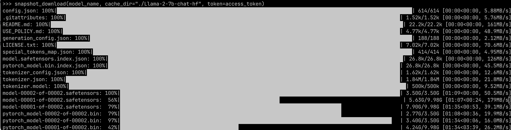

# Llama-7b-HPC

[Intro to HPC slides](https://docs.google.com/presentation/d/1ZVclDpcvBGjm6CYcPu5WaiwdBvfCX7kjw6cy6tQmZD4/edit#slide=id.g292759f6b3d_0_0) 

[Llama 2](https://huggingface.co/meta-llama/Llama-2-7b-chat-hf)

## Preparation

### HPC Environment

1. Move to the compute node by requesting an interactive session for 6 hours: `salloc -t 2:00:00 -G 1 --partition gpu_devel`
2. Load Miniconda module: `module load miniconda`
3. Create an environment for Llama: `conda create --name llama python=3.10`
4. Activate `llama` conda environment: `conda activate llama`
5. Install Pytorch: `conda install pytorch torchvision torchaudio pytorch-cuda=12.1 -c pytorch -c nvidia`
6. Test cuda using python 
7. Install Hugging Face dependencies: 
   1. `conda install conda-forge::transformers` ([tutorial](https://huggingface.co/docs/transformers/installation)）
   2. `conda install -c huggingface -c conda-forge datasets` ([tutorial](https://huggingface.co/docs/datasets/installation))
   3. `conda install -c conda-forge accelerate` ([tutorial](conda install -c conda-forge accelerate))
   4. `pip install bitsandbytes` (Using conda will cause mismatch in cuda version)
8. Install jupyter notebook for playing around `conda install jupyter`
9. Update OOD
   1. `module unload miniconda`
   2. `ycrc_conda_env.sh update`
10. Exit the compute node to release the job: `exit`

### Model Download

1. Apply for access to Llama 2 on [Meta](https://llama.meta.com/llama-downloads) with the same email address used to register Hugging Face
2. Apply for access to Llama 2 model on Hugging Face https://huggingface.co/meta-llama/Llama-2-7b-chat-hf
3. Create a new access token on Hugging Face
4. Switch to `transfer` node for downloading files: `ssh transfer` (100x download speed than on the compute node)
5. Activate the `llama` environment (Remember to load `miniconda` first): `conda activate llama`
6. Navigate to `palmer_scratch` folder on HPC (Used to store large files)
7. Use the following Python Script to download the model files (Other ways to download model can be found [here](https://huggingface.co/docs/transformers/installation))

```python
from huggingface_hub import snapshot_download
model_name = "meta-llama/Llama-2-7b-chat-hf"
access_token = "xxx" #Replace with your own token

snapshot_download(model_name, cache_dir="./Llama-2-7b-chat-hf", token=access_token)
```



## Inference

1. Clone this repo into `project` folder in HPC
2. Open jupyter from [HPC Dashboard](https://sds262.ycrc.yale.edu/pun/sys/dashboard)
3. Select `llama` (The environment created earlier) from the environment setup dropdown menu
4. Allocate at least 4 CPU each with 8 GiBs RAM
5. Launch the jupyter notebook and open `inference.ipynb` for inference
6. Alternatively, use following Python script for inference:

```python
from transformers import AutoModelForCausalLM, AutoTokenizer, AutoConfig
import torch

config = AutoConfig.from_pretrained("/home/sds262_netid/palmer_scratch/Llama-2-7b-chat-hf/config.json") # Replace with own netid or other path for Llama model
model_name = "meta-llama/Llama-2-7b-chat-hf"
access_token = "xxx" # Replace with own token

device = torch.device("cuda" if torch.cuda.is_available() else "cpu")
print(f'Using device: {device}')


model = AutoModelForCausalLM.from_pretrained(model_name, device_map="auto", token=access_token)
tokenizer = AutoTokenizer.from_pretrained(model_name, use_fast=True, token=access_token)
prompt = "[INST] Tell me about Zhejiang University [/INST]"

model_inputs = tokenizer(prompt, return_tensors="pt").to(device)
output = model.generate(**model_inputs)
print(tokenizer.decode(output[0], skip_special_tokens=True))
```

## Fine-tune

1. Ensure you have cloned this repo into `project` folder in HPC
2. Install dependencies for QLoRA finetuning, remember to `conda activate llama` before installing: `pip install trl peft`
3. Update OOD
   1. `module unload miniconda`
   2. `ycrc_conda_env.sh update`
4. Select jupyter from [HPC Dashboard](https://sds262.ycrc.yale.edu/pun/sys/dashboard)
5. Select `llama` (The environment created earlier) from the environment setup dropdown menu
6. Allocate at least 1 GPU (Sometimes the RAM may not be sufficient, it depends on the GPU you get)
7. Connect jupyter notebook and open `finetune.ipynb` for finetuning. 
   1. The example in the notebook is for the [sql-create-context](https://huggingface.co/datasets/b-mc2/sql-create-context) dataset on Hugging Face.
   2. If using other dataset, need to preprocess the dataset based on [this article](https://huggingface.co/blog/llama2#how-to-prompt-llama-2)

## HPC Related Code

`squeue --me`

`ssh NODELIST`
